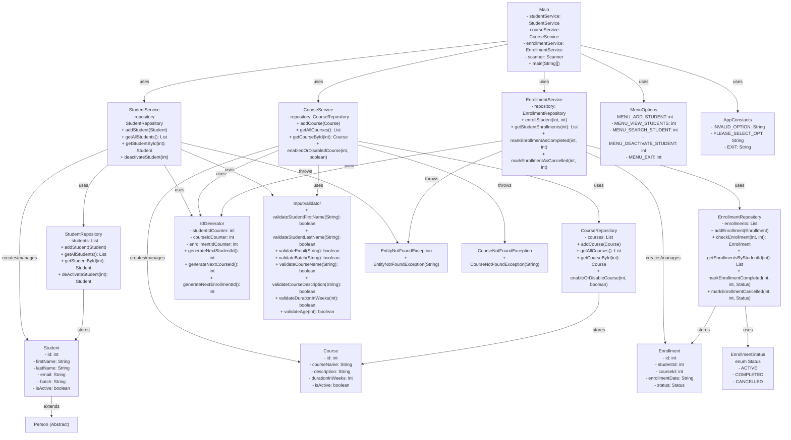

# LearnTrack - Class Relationship Diagram

## 1. UML Class Diagram (Mermaid Format)



---

## 2. Architecture Layers Diagram

```
┌─────────────────────────────────────────────────────────┐
│                   PRESENTATION LAYER                    │
│                       (Main.java)                       │
│  - User Interaction                                     │
│  - Menu Display                                         │
│  - Input/Output Handling                                │
└────────────┬────────────────────────────────────────────┘
             │
┌────────────▼────────────────────────────────────────────┐
│                    SERVICE LAYER                        │
│  ┌──────────────────┬──────────────────┬──────────────┐ │
│  │StudentService    │CourseService     │EnrollmentSvc│ │
│  ├──────────────────┼──────────────────┼──────────────┤ │
│  │• addStudent()    │• addCourse()     │•enrollStudnt│ │
│  │• getStudentById()│• getCourseById() │•viewEnrollm │ │
│  │• getAllStudents()│• getAllCourses() │•markComplete│ │
│  │• deactivate()    │• enableDisable() │•markCancel  │ │
│  └──────────────────┴──────────────────┴──────────────┘ │
└────────────┬────────────────────────────────────────────┘
             │
┌────────────▼────────────────────────────────────────────┐
│                   REPOSITORY LAYER                      │
│  ┌──────────────────┬──────────────────┬──────────────┐ │
│  │StudentRepository │CourseRepository  │EnrollmentRep│ │
│  ├──────────────────┼──────────────────┼──────────────┤ │
│  │List<Student>     │List<Course>      │List<Enrollm│ │
│  │                  │                  │             │ │
│  │• CRUD Operations │• CRUD Operations │• CRUD Ops  │ │
│  │• Queries         │• Queries         │• Queries   │ │
│  └──────────────────┴──────────────────┴──────────────┘ │
└────────────┬────────────────────────────────────────────┘
             │
┌────────────▼────────────────────────────────────────────┐
│                    DATA LAYER                           │
│  ┌──────────────────┬──────────────────┬──────────────┐ │
│  │Student List      │Course List       │Enrollment    │ │
│  │(In-Memory)       │(In-Memory)       │List(In-Mem)  │ │
│  └──────────────────┴──────────────────┴──────────────┘ │
└─────────────────────────────────────────────────────────┘
```

---

## 3. Entity Relationships (ER Diagram)

```
┌───────────────┐
│    STUDENT    │
├───────────────┤
│ - id (PK)     │
│ - firstName   │
│ - lastName    │
│ - email       │
│ - batch       │
│ - isActive    │
└───────┬───────┘
        │
        │ 1:N
        │ (enrolls in)
        │
        ▼
┌───────────────┐        ┌──────────────┐
│  ENROLLMENT   │────────│    COURSE    │
├───────────────┤ N:M    ├──────────────┤
│ - id (PK)     │        │ - id (PK)    │
│ - studentId   │        │ - courseName │
│ - courseId    │        │ - description│
│ - enrollDate  │        │ - duration   │
│ - status      │        │ - isActive   │
└───────────────┘        └──────────────┘

Status: ACTIVE, COMPLETED, CANCELLED
```

---

## 4. Data Flow Diagram

```
USER INPUT
    │
    ▼
┌─────────────────────────────────────┐
│      Main Class (Menu Handler)      │
│  - displayMenu()                    │
│  - readUserChoice()                 │
│  - studentMenu()                    │
│  - courseMenu()                     │
│  - enrollmentMenu()                 │
└────────────┬────────────────────────┘
             │
             ▼
      ┌──────────────────┐
      │  Services Layer  │
      │  ┌────────────┐  │
      │  │Validate    │  │
      │  │Input       │  │
      │  └────────────┘  │
      │  ┌────────────┐  │
      │  │Process     │  │
      │  │Business    │  │
      │  │Logic       │  │
      │  └────────────┘  │
      └────────┬─────────┘
               │
               ▼
        ┌──────────────────┐
        │Repository Layer  │
        │  ┌────────────┐  │
        │  │Query       │  │
        │  │Update      │  │
        │  │Add/Delete  │  │
        │  └────────────┘  │
        └────────┬─────────┘
                 │
                 ▼
          ┌──────────────┐
          │ In-Memory    │
          │ Storage      │
          │ Lists        │
          └──────────────┘
```

---

## 5. Class Dependency Matrix

| Class | Depends On | Used By |
|-------|-----------|---------|
| **Student** | Person, EnrollmentStatus | StudentService, StudentRepository, Main |
| **Course** | - | CourseService, CourseRepository, Main |
| **Enrollment** | EnrollmentStatus | EnrollmentService, EnrollmentRepository, Main |
| **StudentService** | StudentRepository, IdGenerator, InputValidator, Student | Main |
| **CourseService** | CourseRepository, IdGenerator, InputValidator, Course | Main |
| **EnrollmentService** | EnrollmentRepository, IdGenerator, Enrollment, EnrollmentStatus | Main |
| **StudentRepository** | Student | StudentService |
| **CourseRepository** | Course | CourseService |
| **EnrollmentRepository** | Enrollment, EnrollmentStatus | EnrollmentService |
| **IdGenerator** | - | All Services |
| **InputValidator** | - | StudentService, CourseService |
| **Main** | All Services, All Entities | Entry Point |

---

## 6. Component Interaction Flow

### Student Management Flow:
```
User → Main.addNewStudent()
    ↓
Main.addNewStudent() validates input
    ↓
StudentService.addStudent(Student)
    ↓
IdGenerator.generateNextStudentId()
    ↓
StudentRepository.addStudent(Student)
    ↓
Student added to in-memory List
    ↓
Logger.info() - Success message
```

### Course Management Flow:
```
User → Main.addCourse()
    ↓
Main.addCourse() validates input
    ↓
CourseService.addCourse(Course)
    ↓
IdGenerator.generateNextCourseId()
    ↓
CourseRepository.addCourse(Course)
    ↓
Course added to in-memory List
    ↓
Logger.info() - Success message
```

### Enrollment Management Flow:
```
User → Main.enrollStudentMenu()
    ↓
Main.enrollStudentMenu() reads studentId & courseId
    ↓
EnrollmentService.enrollStudent(int, int)
    ↓
Check duplicate enrollment via Repository
    ↓
Create Enrollment object with ACTIVE status
    ↓
IdGenerator.generateNextEnrollmentId()
    ↓
EnrollmentRepository.addEnrollment(Enrollment)
    ↓
Enrollment added to in-memory List
    ↓
Logger.info() - Success message
```

---

## 7. Package Structure

```
com.airtribe.learntrack/
├── Main.java
├── entity/
│   ├── Person.java (Abstract Base Class)
│   ├── Student.java (extends Person)
│   ├── Course.java
│   └── Enrollment.java
├── service/
│   ├── StudentService.java
│   ├── CourseService.java
│   └── EnrollmentService.java
├── repository/
│   ├── StudentRepository.java
│   ├── CourseRepository.java
│   └── EnrollmentRepository.java
├── constants/
│   ├── AppConstants.java
│   ├── EnrollmentStatus.java
│   └── MenuOptions.java
├── exception/
│   ├── EntityNotFoundException.java
│   └── CourseNotFoundException.java
└── util/
    ├── IdGenerator.java
    └── InputValidator.java
```

---

## 8. Key Design Patterns Used

| Pattern | Where | Purpose |
|---------|-------|---------|
| **Layered Architecture** | Main → Service → Repository | Separation of concerns |
| **Repository Pattern** | Repository Classes | Data access abstraction |
| **Service Layer** | Service Classes | Business logic encapsulation |
| **Singleton (Logger)** | All Classes | Centralized logging |
| **Enum** | EnrollmentStatus | Type-safe status values |
| **Factory Method** | IdGenerator | ID generation |
| **Validator Pattern** | InputValidator | Input validation |

---

## 9. Relationships Summary

### Inheritance:
- **Student extends Person**

### Composition/Association:
- **Main uses StudentService, CourseService, EnrollmentService**
- **Services use Repositories**
- **Services use IdGenerator and InputValidator**
- **Repositories manage Entity Lists**

### Dependency:
- **All Services → IdGenerator (for ID generation)**
- **All Classes → Logger (SLF4J)**
- **Exception Classes → All Services**
- **EnrollmentStatus Enum → Enrollment, EnrollmentRepository, EnrollmentService**

---

## 10. Data Storage Structure

```
StudentRepository:
    private static List<Student> students = [
        Student{id=1, firstName="...", lastName="...", ...},
        Student{id=2, firstName="...", lastName="...", ...},
        ...
    ]

CourseRepository:
    private static List<Course> courses = [
        Course{id=1, courseName="Java", ...},
        Course{id=2, courseName="Python", ...},
        ...
    ]

EnrollmentRepository:
    private static List<Enrollment> enrollments = [
        Enrollment{id=1, studentId=1, courseId=1, status=ACTIVE, ...},
        Enrollment{id=2, studentId=2, courseId=2, status=COMPLETED, ...},
        ...
    ]
```

---

## Summary

✅ **3-Layer Architecture**: Presentation → Service → Repository → Data
✅ **Loose Coupling**: Services depend on abstractions (Repositories)
✅ **High Cohesion**: Each class has single responsibility
✅ **Reusability**: IdGenerator and InputValidator used across services
✅ **Exception Handling**: Custom exceptions for error management
✅ **Logging**: SLF4J integrated across all layers
✅ **In-Memory Storage**: Lists for persistence (can be replaced with DB)


