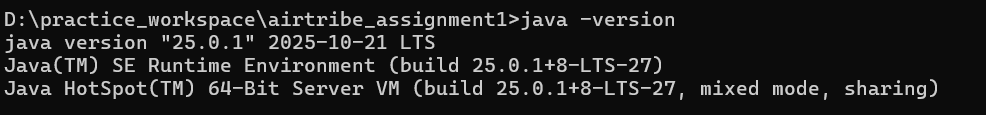

1. Java version used is Jdk 25
2. 

What is JDK?
JDK stands for Java Development Kit. It has all the necessary tools to develop java applications. It contains JRE (Java Runtime Environment) which provides libraries that are needed to run java application also it contains a compiler (javac) which is used to compile java source code into bytecode that can be executed by the Java Virtual Machine (JVM). JDK also includes other tools such as debuggers, documentation generators, and various utilities for managing Java applications. It is essential for developers who want to create Java applications, as it provides the necessary environment and tools for development.

What is JRE?
JRE stands for Java Runtime Environment. It is a part of the Java Development Kit (JDK) and provides the necessary libraries and components to run Java applications. The JRE includes the Java Virtual Machine (JVM), which is responsible for executing Java bytecode, as well as a set of standard libraries that provide functionality for tasks such as input/output, networking, and graphical user interface (GUI) development. The JRE does not include development tools like compilers or debuggers, so it is primarily intended for end-users who want to run Java applications rather than develop them.

What is JVM?
JVM stands for Java Virtual Machine. The JVM is responsible for executing Java bytecode, which is the compiled form of Java source code. It provides a platform-independent execution environment, meaning that Java programs can run on any device or operating system that has a compatible JVM installed. The JVM performs various tasks such as memory management, garbage collection, and security checks to ensure the efficient and secure execution of Java applications. It also allows for features like just-in-time (JIT) compilation, which can improve the performance of Java applications by compiling bytecode into native machine code at runtime.